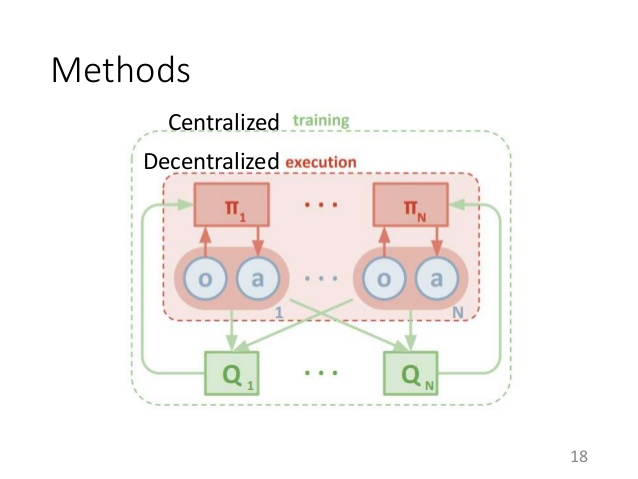
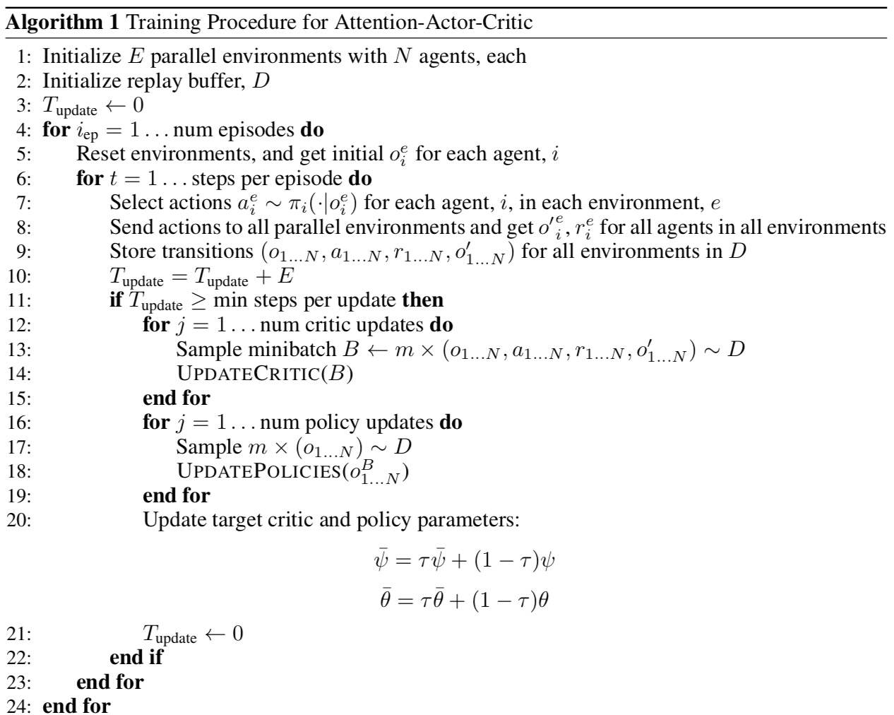
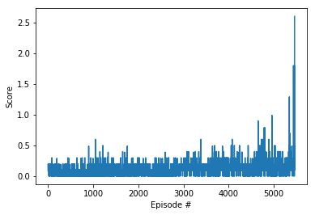
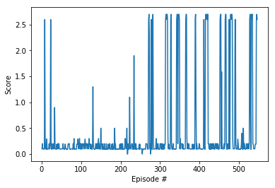
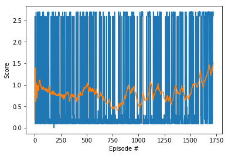
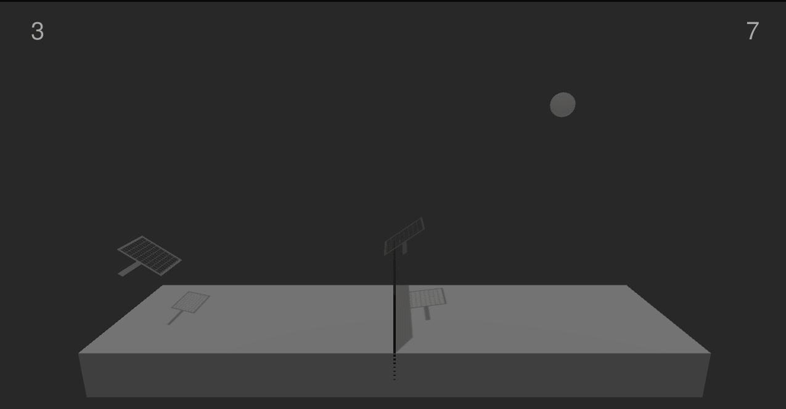

[//]: # (Paper References)

[Paper1]: https://arxiv.org/pdf/1810.02912.pdf
[image2]: https://arxiv.org/pdf/1805.08776.pdf

# Multi-agent DDPG Report

### Introduction

For this project, multiple AI agent is trained to control rackets to bounce a ball over a net. If an agent hits the ball over the net, it receives a reward of +0.1.  If an agent lets a ball hit the ground or hits the ball out of bounds, it receives a reward of -0.01.  Thus, the goal of each agent is to keep the ball in play. After the training, the average score over 100 eposide can reach above 1.5.

### Algorithm
In this project, we use a centralized critic/decentralized actor multi-agent reinforcement learning algorithm introduced in [here](https://arxiv.org/pdf/1810.02912.pdf). Each agent has a policy network to generate the action. All agents have a shared value network that generate the values of all agents state and action. The detailed algorithm is introduced as below two figures.

### Model Architechture

### Hyperparameters

### Results

Initial searching process, very slow and not stable.

After the network loss gradient had reasonable trend, smaller noise and learning rate is used to gradually optimize the weight.

Finally, very small noise and lr is used to reach the best performace. The average score is kept above 0.5 for more than 2000 episode and the highest average score reaches 1.5.

### Future Work
   - 1. Try some different actor/critic network artitechture to test the performance.

   - 2. Search approprate learning rate and noise decay rate to optimize the training process.

   - 3. A more difficult **Soccer** environment worth to explore to seek how to train agents to collabrate and competition. [here](https://github.com/Unity-Technologies/ml-agents/blob/master/docs/Learning-Environment-Examples.md#soccer-twos).  
